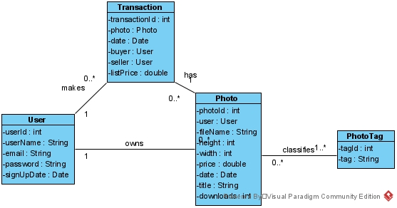

#  Banana Photo Store

Project in built using Java Spring. It intends to serve a photo marketplace that allows users to buy and sell pictures.
For testing DB it is using HB2 database. 

Link for front-end project repo:
[BPS Front-end](https://github.com/mksiq/bps-front)

Link for front-end project running:
[Heroku](https://bps-frontend.herokuapp.com/)

Link for this back-end project running:
[Heroku](https://bps-backend.herokuapp.com/)

As these projects are on free Heroku Dynos, it may take a while to wake up the server.

## Entities:
 

Photos, Tags, Users, and Transactions

The concept is a photo marketplace that allow users to list their photos for other users to buy. Each transaction must be stored. To query and categorize Photos there are Tags. <del>New users and transactions are confirmed by e-mails.</del> Passwords are stored encoded by BCrypt.

A user may delete itself, but their photos can't be deleted as it may have already been bought by another user.

For the database, it uses for testing H2DB, MySQL in the production version.

Both Java server and MySQL db is hosted on Heroku.

Photos are stored on Amazon AWS S3. To save space and bandwidth the images are resized to only 1600px of width. The Thumbnails are created with only 300px and cropped into squares. 

Authentication is done with the use of Tokens Auth0 JWT.

## Some available end-points for GET

## /tags
***/tags*** 
> Returns all tags.

***/tags/{id}***
> Query a tag by Id, returns array of photos with user that uploaded that photo.

***/tags/tag={string}***
> Query a tag by its name, returns array of photos. example: /tags=banana. This is called multiple times for searching for multiple tags.

Any user may insert tags. It is done when inserting a photo. If it does not exist it is created, if it already exists then that photo is linked to the existing tag. All tags are unique.

Only admins may delete or update tags.

## photos
***/photos*** 
> Returns all photos

***/photos/{id}***
> Query a photo by Id, contains an array of tags, and the user that uploaded that photo:

Only admins may delete photos as it is necessary to keep the picture for older transactions. Something that could do emulate that is a boolean isActive field, so the *deleted* photo  no longer appears in searches.

Any logged user may insert photos. A logged user may update their photos information.

## /transactions
***/transactions***
> Returns all transactions. Only available to Admins.

/transactions/{id}
> Query a transaction by Id. Only Only available to Admins. 

Any logged user may Insert a transaction (buy a Photo). By doing so it inserts a sold transaction to the that Photo owner. To add a transaction all necessary is the photo id, since the photo holds the list price, the owner, and the server keeps track of who is the logged user that is buying it.  

Users have both bought and sold transactions. When a logged user get their own User information both list of transactions come attached.

Only Admins may delete transactions.

## /users
***/users***
> Returns all users. Only available to admins. Does not bring password.

***/users/{id}***
> Query by Id. Returns users with all uploaded photos, bought transactions, and sold transactions. Only available to themselves and admin.

***/users/email/value={string}***
> Query by an email. It is used for logging in.

Non logged users may sign up. Logged users may update their information. Logged user may delete himself.

